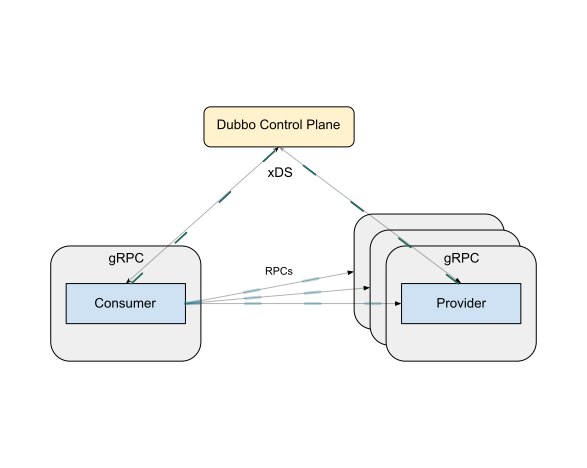

> 目前处于初步设计实验阶段。后续标准功能会逐步完善和支持。

# 引言
Dubbo Inherent Mesh 是 2025 年推出的 Proxyless 模式。该模式不需要代理，控制平面可以直接通过 xDS 向 gRPC 服务下发策略，实现与 gRPC 服务的直接通信。

Dubbo 代理负责初始化与控制平面进行通信，该代理不会接收任何流量作为数据平面通信，最后代理会获取并轮转数据平面流量中使用的证书。

## 架构概览

<p align="center">
  
</p>

## 快速入门
转到 Dubbo 发布页面，自动下载适用于您操作系统的安装文件并获取最新版本（Linux 或 macOS）：

```bash
curl -L https://dubbo.apache.org/downloadDubbo | sh -
```

转到 Dubbo 包目录：

```bash
cd dubbo-0.3.6
```

使用 default 配置文件安装 Dubbo：

```bash
dubboctl install --set profile=default
```